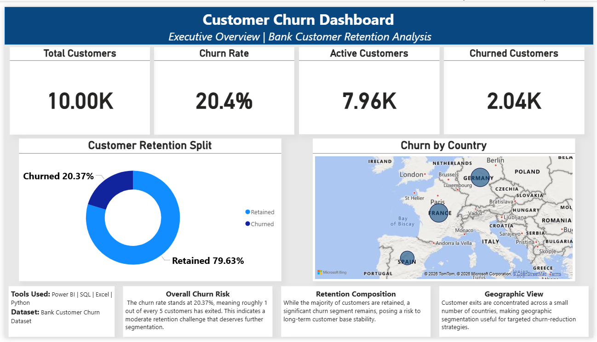
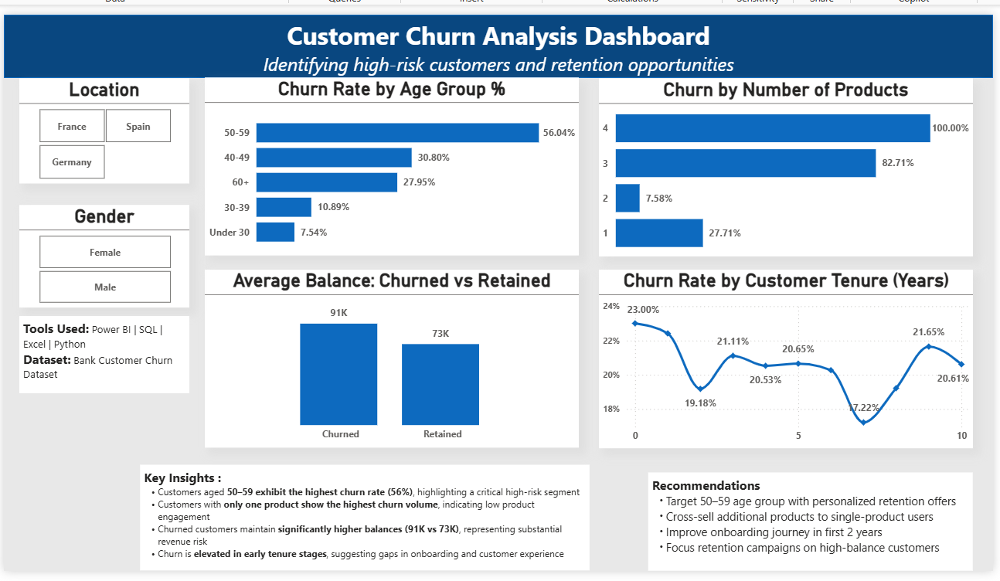
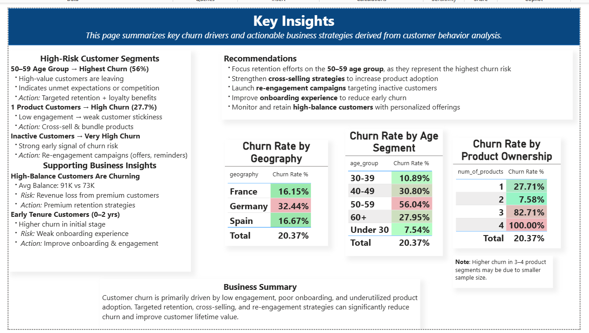

# 🏦 Bank Customer Churn Analysis

An end-to-end data analytics project analyzing customer churn behavior in a banking dataset to identify key drivers of attrition and provide actionable retention strategies.

---

## 📌 Project Overview

Customer churn is one of the most costly problems in banking. Losing a customer means losing not just their business — but their entire lifetime value. This project explores **why customers leave**, **which segments are most at risk**, and **what the business can do about it**.

The analysis covers 10,000 bank customers across France, Germany, and Spain, examining demographics, financial attributes, and product usage to surface high-risk segments.

---

## 📌 Dashboard Previews




---

## 🎯 Business Questions Answered

1. What is the overall churn rate?
2. Which countries have the highest churn?
3. Does gender influence churn behavior?
4. How does the number of products affect churn?
5. Do churned customers have higher balances and credit scores?
6. Does tenure (years as a customer) affect churn likelihood?
7. Which age group is most at risk?

---

## 🛠️ Tools Used

| Tool | Purpose |
|---|---|
| **Excel** | Raw data review, cleaning, pivot table summaries |
| **SQL (PostgreSQL)** | Data validation, aggregation, business queries |
| **Python** | Exploratory data analysis, visualizations |
| **Power BI** | Interactive dashboard for stakeholder reporting |

---

## 📁 Project Structure

```
bank-customer-churn-analysis/
│
├── data/
│   ├── churn_cleaned.csv               ← Cleaned dataset used in analysis
│   └── churn_cleaning.xlsx             ← Raw Excel cleaning file
│
├── sql/
│   └── churn_analysis.sql              ← All 6 SQL queries
│
├── sql_outputs/
│   ├── overall_churn_rate.csv
│   ├── churn_by_country.csv
│   ├── churn_by_gender.csv
│   ├── churn_by_products.csv
│   ├── balance_credit_churn_status.csv
│   └── churn_by_tenure_bucket.csv
│
├── python/
│   └── customer_churn_eda.ipynb        ← Full EDA notebook
│
├── powerbi/
│   └── customer_churn_dashboard.pbix   ← Power BI dashboard
│
├── charts/
│   ├── churn_by_agegroup.png
│   ├── churn_by_country.png
│   ├── churn_by_gender.png
│   ├── churn_by_products.png
│   ├── dashboard_1.png
│   ├── dashboard_2.png
│   ├── dashboard_3.png
│   └── overall_churn.png
│
└── README.md
```

---

## 📊 Dataset

- **Source:** [Bank Customer Churn Dataset — Kaggle](https://www.kaggle.com/datasets/shubhammeshram579/bank-customer-churn-prediction)
- **Rows:** 10,000 customers
- **Columns:** 13 

| Column | Description |
|---|---|
| `customer_id` | Unique customer identifier |
| `surname` | Customer identifier |
| `credit_score` | Credit score (350–850) |
| `geography` | Country (France, Germany, Spain) |
| `gender` | Male / Female |
| `age` | Customer age in years |
| `tenure` | Years as a bank customer |
| `balance` | Account balance in USD |
| `num_of_products` | Number of bank products held |
| `has_creditcard` | 1 = has credit card, 0 = does not |
| `is_activemember` | 1 = active member, 0 = inactive |
| `estimated_salary` | Estimated annual salary in USD |
| `exited` | **Target** — 1 = churned, 0 = retained |

---

## 🔄 Workflow

```
Excel          →      SQL           →      Python        →     Power BI
──────────────────────────────────────────────────────────────────────
Raw review          Load & query         Deep EDA           Dashboard
Data cleaning       Aggregate            Visualizations     KPI cards
Data dictionary     Validate             Charts saved       Slicers
Pivot tables        Export CSVs          Insights           Report
```

---

## 🔍 Key Findings

### 1. Overall Churn Rate
 **20.37%** of customers churned — 2,037 out of 10,000 customers left the bank.

### 2. Churn by Geography
| Country | Total Customers | Churned | Churn Rate |
|---|---|---|---|
| 🔴 Germany | 2,509 | 814 | **32.44%** |
| 🟡 Spain | 2,477 | 413 | 16.67% |
| 🟢 France | 5,014 | 810 | 16.15% |

Germany churns at **2x the rate** of France and Spain.

### 3. Churn by Gender
| Gender | Total Customers | Churned | Churn Rate |
|---|---|---|---|
| 🔴 Female | 4,543 | 1,139 | **25.07%** |
| 🟢 Male | 5,457 | 898 | 16.46% |

Female customers churn at a **9-point higher rate** than male customers.

### 4. Churn by Number of Products
| Products | Total Customers | Churned | Churn Rate |
|---|---|---|---|
| 🟢 2 Products | 4,590 | 348 | **7.58%** |
| 🟡 1 Product | 5,084 | 1,409 | 27.71% |
| 🔴 3 Products | 266 | 220 | **82.71%** |
| 🔴 4 Products | 60 | 60 | **100.00%** |

Customers with 3–4 products have **exceptionally high churn** — a strong signal of over-selling or product mismatch.

### 5. Balance vs Credit Score by Churn Status
| Status | Avg Balance | Avg Credit Score |
|---|---|---|
| Churned | $91,108 | 645 |
| Retained | $72,745 | 652 |

Churned customers carry **$18,000 more on average** — the bank is losing its highest-value relationships.

### 6. Churn by Tenure
| Tenure | Total Customers | Churned | Churn Rate |
|---|---|---|---|
| 0–2 Years | 2,496 | 528 | 21.15% |
| 3–5 Years | 3,010 | 625 | 20.76% |
| 6+ Years | 4,494 | 884 | 19.67% |

Churn is **consistent across all tenure groups** — loyalty alone does not protect customers from churning.

### 7. Churn by Age Group
| Age Group | Churn Rate |
|---|---|
| 18–30 | ~8% |
| 31–45 | ~15% |
| 🔴 46–60 | **~51%** |
| 60+ | ~35% |

The **46–60 age group** churns at 2.5x the overall baseline — the single highest-risk age segment.

---

## 💡 Business Recommendations

### 1.  Launch a Germany-Specific Retention Campaign
Germany's 32.4% churn rate is 1.6x the overall baseline and nearly double France's. The business should investigate root causes — pricing, service quality, local competition — and design a targeted retention offer for German customers.

### 2.  Investigate the Female Customer Experience
Female customers churn 9 points higher than male customers. Exit surveys and qualitative research should identify whether this is driven by product fit, communication gaps, or service quality differences.

### 3.  Audit the 3–4 Product Strategy
100% churn among 4-product customers and 83% among 3-product customers is a critical red flag. The bank must review whether these customers are being over-sold products that don't serve their needs.

### 4.  Build a Middle-Aged Loyalty Programme
At 51% churn, the 46–60 age segment is the most at-risk group. This cohort likely represents the bank's highest lifetime value. Dedicated relationship banking, exclusive rates, and premium support could significantly reduce churn here.

### 5.  Protect High-Balance Customers
Churned customers hold $18,000 more on average than retained ones. An early-warning system flagging disengagement signals among customers with balances above $90K should be introduced as a priority.

---

## 📈 Power BI Dashboard

The interactive dashboard includes:
- **Page 1 — Overview:** Total customers, churn rate KPI, active vs churned donut chart, map visual by geography
- **Page 2 — Segment Analysis:** Churn by age group, gender, product count, and tenure with gender/country slicers
- **Page 3 — Business Insights:** Top risk segments, recommendations, and a full summary table

> To view the dashboard, download `powerbi/customer_churn_dashboard.pbix` and open with [Power BI Desktop](https://powerbi.microsoft.com/desktop/) (free).

---

## 🐍 Running the Python Notebook

```bash
# 1. Clone this repo
git clone https://github.com/dibyashreee/Bank-Customer-Churn-Analysis.git
cd Bank-Customer-Churn-Analysis

# 2. Install dependencies
pip install pandas matplotlib seaborn jupyter

# 3. Launch the notebook
jupyter notebook python/customer_churn_eda.ipynb
```

> Make sure `data/churn_cleaned.csv` is present before running. Charts will auto-save to `charts/`.

---

## 🗄️ Running the SQL Queries

1. Create a PostgreSQL database and run the `CREATE TABLE` statement in `sql/churn_analysis.sql`
2. Import `data/churn_cleaned.csv` into the `churn_data` table
3. Run each query — results match the exported CSVs in `sql_outputs/`

---

## 📬 Contact

**Author:** Dibyashree Dey 

**LinkedIn:** www.linkedin.com/in/dibyashreedey 

**Email:** dibyashree15dey01@gmail.com

---

*This project is part of an end-to-end data analyst portfolio demonstrating skills in Excel, SQL, Python, and Power BI.*
